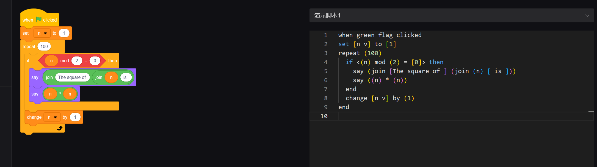

# Code-Agent

## install

```bash
pip install -r requirements.txt
```

## Usage
Generate `scratchblocks` code from with your `prompt`.
For example:

*Count 1 to 100 if it is a even number, and print its square.*


```
python main.py --prompt "Count 1 to 100 if it is a even number, and print its square."
```

Output.
```bash
when green flag clicked
set [n v] to [1]
repeat (100)
  if <(n) mod (2) = [0]> then
    say (join [The square of ] (join (n) [ is ]))
    say ((n) * (n))
  end
  change [n v] by (1)
end

```



## Run server && Front UI
    
- Run the local server
```bash
python server.py
```

- Run local UI
```bash
cd html 
npm install
npm start
```

Now the UI is running on `http://localhost:8000/`